# Agent Relay Protocol

Status: Draft
Date: 2026-03-07

---

## 1. Problem Statement

Agents increasingly work not in isolation but alongside humans — in shared code, shared documents, shared tasks. The industry has already built working products: Devin, GitHub Copilot coding agent, Cursor Cloud Agents, Factory Droids, Replit Agent. Each implements the same pattern — **shared human/agent realm** — but does it in its own way, with proprietary APIs and closed models.

Today there are protocols for individual layers:
- **MCP** standardizes access to tools and context — and has become the de facto "tool bus" across all mature agent platforms.
- **A2A** (Google) describes agent-to-agent interaction.
- **ACP** defines how IDEs and clients interact with an agent.

But none of them answer the question: **how to create a shared realm** where humans and agents work together on a task in a controlled environment with shared filesystem, tools, permissions, and history?

Without such a protocol, every platform reinvents this from scratch: its own realm model, its own way to launch agents, its own permission and approval system, its own environment isolation. Practice shows that successful systems converge on the same patterns — RBAC + runtime guardrails, async agent + human review, MCP as tool bus, checkpoints and rollbacks — but implement them incompatibly. Agents end up locked to a specific platform. No portability, no interoperability, no unified security model.

Agent Relay Protocol closes this gap — a standard protocol for building human/agent collaborative environments. The protocol can have different implementations, but thanks to a common standard, components — runtimes, agents, environments, tools — can work with each other and be interchangeable.

## 2. Use Cases

**Code.** A developer and product manager work on the same codebase in one realm. Agents operate within the realm. Code is mounted in the realm environment, the application is running, participants discuss, modify code, and test results.

**Business.** A salesperson and marketer work on a lead in one realm. Agents help analyze the account, CRM data, and next steps. The realm environment contains documents, notes, CRM context, and tools.

**Incident Response.** A realm is created on an alert, on-call engineers and agents connect. Agents pull logs, metrics, traces, and analyze the root cause. Humans and agents debug and fix together in one environment.

**Data Analysis.** An analyst and data engineer work in one realm. Agents help write SQL, build visualizations, validate data. The environment includes database connections, notebooks, and datasets.

**Code Review.** A realm is automatically created on a pull request. Reviewers and agents connect to it. Agents analyze the diff, check code style, look for bugs and security issues. Reviewers see analysis results, discuss changes with agents and each other, and make a decision — all in one realm with access to code and CI.

**Pipeline.** Realms are chained together through events. PR → code review realm emits `review.completed` → deploy realm is created automatically → after deployment emits `deploy.completed` → monitoring realm watches metrics. Each step is a full realm with humans and agents, without an external orchestrator.

## 3. High-Level Patterns

Analysis of existing platforms (Devin, GitHub Copilot, Cursor, Factory, Replit) reveals stable architectural patterns that Agent Relay codifies into a standard protocol:

**Shared artifact, not just chat.** Successful systems build collaboration around a concrete artifact — a PR, branch, checkpoint, context space — not just a chat. A Realm in Agent Relay is both a chat room and a controlled environment with code, data, and tools, tied to a specific task or artifact.

**Async agent + human review/handoff.** Mature products have moved from the "human and agent simultaneously editing" model to "agent works asynchronously, human connects for review, approval, or takeover." Agent Relay supports both modes, but approval flow and notification channels are optimized specifically for the async pattern.

**RBAC + runtime guardrails.** Security through real controls, not prompting: team roles, org policies, network restrictions, approval gates, sandboxes. In Agent Relay these are Policy, Grant, Approval, and MCP Gateway.

**MCP as tool bus.** All mature platforms use MCP for connecting external tools. Agent Relay does not invent its own tool protocol but builds MCP Gateway as an authorization and discovery layer on top of MCP.

**Checkpoints and rollbacks.** The ability to roll back a realm to a previous state is critically important for safe work with agents. Agent Relay includes checkpoint/restore as part of the realm lifecycle.

**From ad-hoc dialogue to explicit protocol.** Every platform implements the same patterns incompatibly. Agent Relay codifies these patterns into an open standard, making components interchangeable.

## 4. Overview

### 4.1 Key Resources

| Resource | Description |
|---|---|
| **Namespace** | Isolation and tenancy. All resources belong to a namespace. Quotas, billing. |
| **User** | A human in the system. Identity, groups, realm membership. |
| **Realm** | Working space — chat room + environment. Humans and agents work together. |
| **Agent** | An agent instance in a realm. References an AgentHarness or is described inline. |
| **AgentHarness** | Agent wrapper: provider, model, skills, tools. Reusable. |
| **Skill** | Runtime wrapper for an Agent Skill: tools binding, suggested policies, risk tier. Content — Agent Skills spec (SKILL.md). |
| **ToolProvider** | MCP server — source of tools. Registered in MCP Gateway. |
| **Policy** | Access rule for tools: who, what, effect (allow / deny / approval_required). |
| **Grant** | Delegation of a specific right: once, temporary, permanent. |
| **Approval** | Request for permission to make a tool call. Created by runtime, answered by approver via JWT. |
| **NotificationChannel** | Event delivery channel: approvals, messages, realm changes. |
| **EventProvider** | Source of external events: GitHub webhooks, PagerDuty, cron. |
| **Subscription** | On event from EventProvider → create realm from template. |
| **RealmTemplate** | Template for automatic realm creation. |
| **Checkpoint** | Snapshot of realm state. Rollback, clone, restore. |
| **CustomResourceDefinition** | Custom resource definition. Extends the specification without changing core. |
| **AuditEntry** | Audit log entry: who, what, when, where, result. Immutable. |

### 4.2 Architecture

The protocol is split into two layers:

- **Control plane (Agent Relay API)** — resource management: realms, agents, grants, policies. Kubernetes-style REST API.
- **Data plane (ACP)** — interaction within realm: messages, tool calls, streaming. Realm exposes an ACP endpoint.

Relay is responsible for "what exists and who has access." ACP is responsible for "what happens inside."

```mermaid
flowchart TB
    subgraph Clients
        IDE[IDE / CLI]
        WebUI[Web UI]
        Bot[Slack / Telegram Bot]
    end

    subgraph Runtime["Agent Relay Runtime"]
        API[Control Plane API\nREST k8s-style]
        GW[MCP Gateway\npolicy · approval · audit · secrets]
        PE[Policy Engine]
        AL[Audit Log]
        NF[Notification Service\nwebhook · email · ACP]
        WM[Realm Manager]
        AM[Agent Manager]
        SM[Subscription Manager]
    end

    subgraph Realm["Realm Environment"]
        ENV[Environment\ndocker · k8s · local]
        A1[Agent 1]
        A2[Agent 2]
    end

    subgraph External
        MCP1[MCP Server\ngithub]
        MCP2[MCP Server\nslack]
        REG[Tool Registry]
        EP1[GitHub Webhooks]
        EP2[PagerDuty]
    end

    IDE -- ACP --> WM
    WebUI -- ACP --> WM
    IDE -- REST --> API
    WebUI -- REST --> API
    Bot -- webhook --> NF

    EP1 -- webhook --> SM
    EP2 -- webhook --> SM
    SM -- create realm --> WM

    API --> WM
    API --> AM
    API --> PE

    WM --> ENV
    AM --> A1
    AM --> A2

    A1 -- tool call --> GW
    A2 -- tool call --> GW
    GW --> PE
    GW --> AL
    GW --> NF
    PE -- approval --> NF
    GW --> MCP1
    GW --> MCP2
    GW --> REG

    classDef runtime fill:#e8e0f0,stroke:#5b21b6,color:#1e1b4b,stroke-width:2px;
    classDef realm fill:#fde7d9,stroke:#c2410c,color:#431407,stroke-width:2px;
    classDef client fill:#d9f2e3,stroke:#2d6a4f,color:#123524,stroke-width:2px;
    classDef external fill:#dbeafe,stroke:#1d4ed8,color:#0f172a,stroke-width:2px;
    classDef gateway fill:#fef3c7,stroke:#d97706,color:#451a03,stroke-width:2px;

    class API,PE,AL,NF,WM,AM,SM runtime;
    class GW gateway;
    class ENV,A1,A2 realm;
    class IDE,WebUI,Bot client;
    class MCP1,MCP2,REG,EP1,EP2 external;
```



### 4.3 Key Components

- **Control Plane API** — REST API for resource management.
- **Realm Manager** — creation, launch, and shutdown of realms and environments. Exposes ACP endpoint.
- **Agent Manager** — agent lifecycle: launch, stop, health check.
- **MCP Gateway** — single point of access to tools. Policy check, approval, secret injection, audit, rate limiting, proxying to MCP servers. Includes a registry for discovery.
- **Policy Engine** — computation of effective permissions. Allow/deny/approval_required.
- **Notification Service** — delivery of events and approval requests via webhook, email, ACP.
- **Subscription Manager** — processing of external events, realm creation from templates.
- **Audit Log** — immutable log of all actions.

### 4.4 Realm

Realm is the primary working space. On one hand — a chat room where humans and agents communicate. On the other — a controlled environment with shared filesystem, tools, code, and data.

Environment is a nested part of realm: runtime backend (docker, k8s, local), filesystem, mounts, network policy, secrets. Environment has its own lifecycle — it can be restarted without recreating the realm.

Realm has a stable identity that includes the namespace. Format: `realm.namespace@host`. For example: `payments-debug.acme-corp@relay.example.com`. The identity is globally unique and is used for grants, audit trail, membership, ACP endpoint, and external references. The ACP endpoint is derived from identity: `acp://payments-debug.acme-corp@relay.example.com`.

Realm can subscribe to external events via EventProvider. Events arrive in the realm as chat messages — agents see them and can react. For example, a realm is subscribed to GitHub push events: on a new commit, an agent receives a message, runs tests, and reports the result. This allows the realm to be not just a passive space but a reactive environment.

#### Realm as Event Producer

Realm not only receives events but also emits them. Outgoing events are generated automatically (lifecycle changes) and explicitly (an agent or human emits an event via API).

Types of outgoing events:
- **lifecycle** — `realm.started`, `realm.stopped`, `realm.failed`, `realm.completed`
- **agent** — `agent.started`, `agent.stopped`, `agent.completed`
- **custom** — arbitrary events emitted by an agent: `review.done`, `tests.passed`, `deploy.ready`

A completion event can carry a payload — work result, artifacts, links:

```yaml
kind: RealmEvent
metadata:
  realm: pr-review-42
  timestamp: "2026-03-07T15:00:00Z"
spec:
  type: realm.completed
  payload:
    result: approved
    summary: "No critical issues found, 2 minor suggestions"
    artifacts:
      - type: report
        url: /realms/pr-review-42/artifacts/review.md
```

Outgoing realm events are available to others through the same EventProvider/Subscription mechanism. This allows building **realm chains** without an external orchestrator:

```
PR opened → [code-review realm] → review.completed → [deploy realm] → deploy.completed → [monitoring realm]
```

Each step is a full realm with humans, agents, and tools. The connection is through events.

#### History

Realm message history is an ACP artifact. Message format, streaming, context compaction are the responsibility of ACP and the agent. Relay is responsible only for **persistence and access**: history is stored as long as the realm exists (including Stopped and Archived states), and is deleted with the realm.

Relay provides a read-only API to history for UI, search, and export.

#### Checkpoints & Snapshots

Realm supports checkpoints — snapshots of environment state (filesystem, databases, conversation context). Checkpoints are created automatically (before dangerous operations, on schedule) or manually.

Operations:
- **Checkpoint** — create a snapshot of the current realm state.
- **Rollback** — revert realm to a previous checkpoint.
- **Clone** — create a new realm from an existing checkpoint. Useful for parallel experiments, debugging, or handing off context to another team.

Default rules:
- One environment per realm.
- Participants see a single filesystem view.
- Tool access is explicit and revocable.
- Permissions are realm-scoped, not global.

### 4.5 MCP Gateway

An agent never calls an MCP server directly. All tool calls go through MCP Gateway:

```
Agent → ACP → MCP Gateway → MCP Server / HTTP API / builtin
```

For each tool call, the gateway performs:
1. **Policy check** — verifies permissions.
2. **Approval** — if required, creates an Approval and waits for a response.
3. **Secret injection** — injects credentials. The agent never sees tokens.
4. **Audit** — logs the call, parameters, and result.
5. **Rate limiting** — throttles request frequency.
6. **Proxying** — proxies to the backend.

The gateway is also responsible for **discovery**: catalog of MCP servers, tool search by name, tags, and capabilities.

### 4.6 Skills

Skill is a runtime wrapper for Agent Skills. The skill content format (SKILL.md, instructions, scripts, references) is defined by the [Agent Skills spec](https://agentskills.io) — an open standard from Anthropic, adopted by Microsoft, OpenAI, Cursor, GitHub, and others. Agent Relay does not invent its own instruction format but adds what Agent Skills lacks: **tools binding, permissions, and runtime policy**.

A Skill in Agent Relay connects:
- **Content** — reference to an Agent Skills package (SKILL.md) or inline.
- **Tools** — which tools the skill needs to operate.
- **Policies** — suggested permissions and risk tier.

AgentHarness references skills by name. Upon activation, the agent receives SKILL.md content through progressive disclosure (Agent Skills spec), and Relay automatically connects the required tools and applies suggested policies.

### 4.7 Permissions & Approvals

Tool access is controlled through **Policy** — who (subject), to what (tools), with what effect (allow, deny, approval_required).

#### Risk Tiers

Tools are classified by risk level. A Policy can reference a risk tier instead of listing individual tools:

- **low** — read-only operations, search, file reading. Default: `allow`.
- **medium** — file writing, PR creation, sending messages. Default: `approval_required`.
- **high** — shell execution, deploy, data deletion, network access. Default: `deny`.

The risk tier is set when registering a tool in ToolProvider. A Policy can override the default for any tier. This avoids writing a policy for every tool, instead setting reasonable defaults by risk class.

#### Policy Hierarchy

Policies are inherited top-down: **namespace → realm**. A lower level can only **tighten** the upper level's policy, not loosen it. The namespace admin sets the baseline — a realm owner can add restrictions but cannot remove existing ones.

For example, if a namespace policy denies `shell.execute` for agents — a realm policy cannot allow it. But a realm can additionally deny `fs.write`, even if the namespace allows it.

#### Approval Flow

1. Agent calls a tool → policy requires approval → runtime creates an Approval (Pending).
2. Runtime generates a JWT token and delivers a notification via NotificationChannel (Slack, email, ACP).
3. Approver sees the request with full context, responds via REST with JWT: `PUT /approvals/{id}?token={jwt}&decision=approve`.
4. Runtime verifies JWT, resumes the tool call.

JWT is single-use, signed with the runtime's key. Approval has a TTL — on timeout, the default is deny or escalation.

**Grant** — rights delegation with modes: `once` (single-use), `temporary` (with expiration), `permanent`.

### 4.8 Events & Subscriptions

Realms are created automatically on external events:

- **EventProvider** — event source (GitHub webhooks, PagerDuty, cron). Runtime exposes an endpoint for each provider.
- **RealmTemplate** — realm template with environment, agents, members, policies.
- **Subscription** — binding: event + filter → create realm from template.

Two modes: create a new realm (Subscription) or deliver an event to an already running realm (event routing).

### 4.9 Notifications

NotificationChannel delivers realm events to users outside an ACP connection: approval requests, agent messages, realm changes, agent status. Channel types: webhook, email, ACP event.

### 4.10 Authentication

The runtime does not implement OAuth/OIDC login flow — it only validates tokens from an external OIDC provider. Analogous to Kubernetes.

**Humans** authenticate via OIDC. The client (IDE, Web UI, CLI) obtains a JWT from an OIDC provider (Keycloak, Google, Azure AD, etc.) and passes it in `Authorization: Bearer {token}`. The runtime validates the signature and extracts identity from claims (email, sub, groups).

**Agents** receive ServiceAccount tokens — JWTs issued by the runtime itself. The token is scoped to a specific realm and has limited permissions. The agent does not go through an OAuth flow — the runtime generates the token when launching the agent.

**Runtime config:**

```yaml
kind: RuntimeConfig
spec:
  auth:
    oidc:
      issuerUrl: https://auth.example.com
      clientId: relay-runtime
      usernameClaim: email
      groupsClaim: groups
    serviceAccounts:
      issuer: https://relay.example.com
      signingKey: runtime-key
```

All API and ACP requests must contain a valid token. `GET /apis/relay/v1/whoami` returns the current subject and their effective permissions.

### 4.11 Custom Resources

The specification defines core resources (Realm, Agent, Policy, etc.), but the runtime is open for extension. Anyone can define their own resources through `CustomResourceDefinition` — analogous to CRDs in Kubernetes.

A custom resource automatically gets a full API: CRUD, watch, schema validation. It can be global or realm-scoped. Core mechanisms (audit, RBAC, watch) work with custom resources the same way as with core resources.

```yaml
kind: CustomResourceDefinition
metadata:
  name: projects.example.com
spec:
  group: example.com
  names:
    kind: Project
    plural: projects
  scope: realm
  schema:
    spec:
      type: object
      properties:
        repo: { type: string }
        language: { type: string }
        ci: { type: string }
```

After registering a CRD, you can create resources:

```yaml
kind: Project
metadata:
  name: payments
  realm: payments-debug
spec:
  repo: github.com/org/payments
  language: typescript
  ci: github-actions
```

API: `/apis/example.com/v1/realms/{name}/projects/{project}`

Custom resources are deeply integrated with the permissions system. A Policy can reference custom resources just like tools — you can control who has the right to create, read, update, and delete specific custom resources:

```yaml
kind: Policy
metadata:
  name: only-owners-manage-projects
  realm: payments-debug
spec:
  subject: role:member
  resources: ["projects.*"]
  effect: deny
  except:
    - subject: role:owner
      effect: allow
```

This allows building domain-specific extensions (Project, Task, Pipeline, Deployment) without changing the core specification. Each extension automatically gets a CRUD API, watch, audit, and full RBAC.

### 4.12 Namespaces

Namespace is the isolation and tenancy level. Analogous to Kubernetes namespaces. All resources (realms, agents, policies, grants, templates, etc.) belong to a namespace.

Namespace provides:
- **Isolation** — resources of one namespace are not visible from another.
- **RBAC** — permissions can be granted at the namespace level (e.g., admin of the entire namespace).
- **Quotas** — resource limits per namespace (realms, agents, storage).
- **Billing** — namespace = billing unit.

```yaml
kind: Namespace
metadata:
  name: acme-corp
spec:
  displayName: Acme Corporation
  admins:
    - alice@acme.com
  quotas:
    maxRealms: 50
    maxAgentsPerRealm: 10
```

API prefix: `/apis/relay/v1/namespaces/{ns}/realms/...`

For simple installations, a single `default` namespace can be used — the system works as-is without extra complexity.

```
POST   /apis/relay/v1/namespaces                   — create namespace
GET    /apis/relay/v1/namespaces                   — list namespaces
GET    /apis/relay/v1/namespaces/{ns}              — get namespace
PUT    /apis/relay/v1/namespaces/{ns}              — update namespace
DELETE /apis/relay/v1/namespaces/{ns}              — delete namespace
```

### 4.13 Audit

All actions are logged: tool calls, permission changes, member changes, agent lifecycle. The audit log is immutable and queryable. Each entry: who, what, when, where, result, context.

### 4.14 Security Model

Agent Relay security is built on **deterministic controls**, not prompt steering. The LLM is treated as a powerful but untrusted component — security is ensured by architecture, not by instructions to the agent.

#### Principles

- **Default deny** — an agent has no access to tools until an explicit grant or policy is issued.
- **Deterministic enforcement** — all checks are performed by MCP Gateway and Policy Engine, not the LLM.
- **Least privilege** — the agent receives the minimum permissions needed for the task. ServiceAccount token is scoped to the realm.
- **Policy hierarchy** — namespace policy cannot be loosened by realm policy.
- **Audit everything** — all tool calls, approvals, and permission changes are logged immutably.

#### Threat Model

**1. Prompt injection via shared context.**
The agent reads data from the realm (files, messages, events) — malicious content can contain instructions. Defense: MCP Gateway checks permissions on every tool call regardless of what the agent "asked for." Policy Engine does not trust agent intent; it checks the action.

**2. Data exfiltration.**
The agent may attempt to send data out through tool calls (HTTP requests, shell commands, MCP servers). Defense: network policy at the environment level (egress allowlist, default-deny), risk tier `high` for network-accessing tools, audit log for detection.

**3. Tool abuse / destructive execution.**
The agent may perform destructive operations: file deletion, drop database, force push. Defense: risk tiers (high-risk tools require approval or are denied by default), checkpoints for rollback, approval flow for dangerous operations.

**4. Privilege escalation.**
The agent may attempt to gain higher privileges than granted: through another agent, through a tool that provides access to secrets, through realm event manipulation. Defense: each agent has an isolated ServiceAccount token, secrets are not directly accessible to agents (secret injection via gateway), policy hierarchy prevents loosening.

---

## 5. Resources

The API is built in Kubernetes style: declarative resources with `kind`, `metadata`, `spec`, `status`. Standard HTTP methods for CRUD. Watch via SSE.

```
GET    /apis/relay/v1/{resources}              — list
POST   /apis/relay/v1/{resources}              — create
GET    /apis/relay/v1/{resources}/{name}        — get
PUT    /apis/relay/v1/{resources}/{name}        — update
DELETE /apis/relay/v1/{resources}/{name}        — delete
GET    /apis/relay/v1/{resources}?watch=true    — watch changes (SSE)
```

### 5.1 User

```yaml
kind: User
metadata:
  name: alice
spec:
  email: alice@example.com
  displayName: Alice Smith
  groups:
    - backend-team
    - approvers
```

```
POST   /apis/relay/v1/users                     — create user
GET    /apis/relay/v1/users                     — list users
GET    /apis/relay/v1/users/{name}              — get user
PUT    /apis/relay/v1/users/{name}              — update user
DELETE /apis/relay/v1/users/{name}              — delete user
GET    /apis/relay/v1/users/{name}/realms   — user's realms
```

### 5.2 Realm

```yaml
kind: Realm
metadata:
  name: payments-debug
  namespace: acme-corp
  identity: payments-debug.acme-corp@relay.example.com
spec:
  environment:
    backend: docker
    workingDir: /realm
    mounts:
      - source: git://github.com/org/payments
        target: /realm/code
        mode: rw
    networkPolicy: restricted
    secrets:
      - name: github-token
status:
  phase: Running
  environment:
    phase: Running
  acpEndpoint: acp://payments-debug.acme-corp@relay.example.com
```

```
POST   /apis/relay/v1/realms                           — create realm
GET    /apis/relay/v1/realms                           — list realms
GET    /apis/relay/v1/realms/{name}                    — get realm
PUT    /apis/relay/v1/realms/{name}                    — update realm
DELETE /apis/relay/v1/realms/{name}                    — delete realm
GET    /apis/relay/v1/realms/{name}/status             — realm status
PUT    /apis/relay/v1/realms/{name}/environment/start  — start environment
PUT    /apis/relay/v1/realms/{name}/environment/stop   — stop environment
GET    /apis/relay/v1/realms?watch=true                — watch changes
```

#### History

Read-only API to realm ACP history.

```
GET    /apis/relay/v1/realms/{name}/messages                — message history
GET    /apis/relay/v1/realms/{name}/messages?author={a}&type={t}&from={ts}&to={ts}&q={search} — filter and search
```

#### Events (outgoing)

Realm emits events — lifecycle and custom. Agents and external systems can subscribe to them.

```
POST   /apis/relay/v1/realms/{name}/events               — emit event
GET    /apis/relay/v1/realms/{name}/events               — list events
GET    /apis/relay/v1/realms/{name}/events?watch=true    — subscribe to events (SSE)
```

Realm as EventProvider for other subscriptions:

```yaml
kind: Subscription
metadata:
  name: deploy-after-review
spec:
  provider: realm://pr-review-*
  filter:
    type: realm.completed
    payload.result: approved
  template: auto-deploy
  naming: "deploy-{{ event.realm }}"
```

#### Checkpoints

```yaml
kind: Checkpoint
metadata:
  name: before-migration
  realm: payments-debug
spec:
  description: "Snapshot before running DB migration"
  auto: false
status:
  createdAt: "2026-03-07T14:00:00Z"
  size: 256Mi
```

```
POST   /apis/relay/v1/realms/{name}/checkpoints              — create checkpoint
GET    /apis/relay/v1/realms/{name}/checkpoints              — list checkpoints
GET    /apis/relay/v1/realms/{name}/checkpoints/{cp}         — get checkpoint
DELETE /apis/relay/v1/realms/{name}/checkpoints/{cp}         — delete checkpoint
POST   /apis/relay/v1/realms/{name}/checkpoints/{cp}/rollback — rollback to checkpoint
POST   /apis/relay/v1/realms/{name}/checkpoints/{cp}/clone    — create new realm from checkpoint
```

#### Event Subscriptions

Realm subscription to events from EventProvider. Events are delivered as messages into the realm.

```
POST   /apis/relay/v1/realms/{name}/eventsubscriptions              — subscribe to events
GET    /apis/relay/v1/realms/{name}/eventsubscriptions              — list subscriptions
DELETE /apis/relay/v1/realms/{name}/eventsubscriptions/{sub}        — unsubscribe
```

```yaml
kind: RealmEventSubscription
metadata:
  realm: payments-debug
spec:
  provider: github-org
  filter:
    event: push
    ref: refs/heads/main
```

#### Members

```yaml
kind: Member
metadata:
  realm: payments-debug
spec:
  subject: alice@example.com
  role: owner
```

```
POST   /apis/relay/v1/realms/{name}/members              — add member
GET    /apis/relay/v1/realms/{name}/members              — list members
DELETE /apis/relay/v1/realms/{name}/members/{subject}    — remove member
```

Roles: `owner`, `member`, `viewer`, `approver`. Access via direct assignment or group.

### 5.3 Agents

#### AgentHarness

A reusable agent template.

```yaml
kind: AgentHarness
metadata:
  name: code-reviewer
spec:
  provider: anthropic/claude-code
  model: claude-sonnet-4-20250514
  skills:
    - code-review
    - security-audit
  tools:
    - shell
    - file-read
    - file-write
  maxTokens: 16000
```

Skills bring instructions (SKILL.md content) and suggested tools/policies. A harness can add additional tools on top of those required by skills.

#### Agent

An agent instance in a realm. References an AgentHarness or is described inline.

```yaml
kind: Agent
metadata:
  name: reviewer
  realm: payments-debug
spec:
  harness: code-reviewer
status:
  phase: Running
```

Inline variant (without a separate AgentHarness):

```yaml
kind: Agent
metadata:
  name: helper
  realm: payments-debug
spec:
  provider: anthropic/claude-code
  model: claude-sonnet-4-20250514
  systemPrompt: "You are a helpful assistant."
status:
  phase: Running
```

```
POST   /apis/relay/v1/realms/{name}/agents               — add agent
GET    /apis/relay/v1/realms/{name}/agents               — list agents
GET    /apis/relay/v1/realms/{name}/agents/{agent}       — get agent
DELETE /apis/relay/v1/realms/{name}/agents/{agent}       — remove agent
PUT    /apis/relay/v1/realms/{name}/agents/{agent}/start — start agent
PUT    /apis/relay/v1/realms/{name}/agents/{agent}/stop  — stop agent
```

AgentHarness API:

```
POST   /apis/relay/v1/agentharnesses                           — create harness
GET    /apis/relay/v1/agentharnesses                           — list harnesses
GET    /apis/relay/v1/agentharnesses/{name}                    — get harness
PUT    /apis/relay/v1/agentharnesses/{name}                    — update harness
DELETE /apis/relay/v1/agentharnesses/{name}                    — delete harness
```

### 5.4 Skills

```yaml
kind: Skill
metadata:
  name: code-review
spec:
  source: github://org/skills/code-review    # Agent Skills package (SKILL.md)
  tools:
    - fs.read
    - github.pr.comment
    - github.pr.review
  policies:
    - effect: allow
      tools: [fs.read, github.pr.*]
    - effect: approval_required
      tools: [github.pr.merge]
  suggestedRisk: low
```

Inline skill (without an external package):

```yaml
kind: Skill
metadata:
  name: quick-test-runner
spec:
  description: "Run tests and report results"
  instructions: |
    Run the project test suite. Report failures with file and line.
    If all tests pass, summarize coverage.
  tools:
    - shell.execute
    - fs.read
  policies:
    - effect: allow
      tools: [shell.execute]
      params:
        command: ["npm test", "pytest", "go test ./..."]
  suggestedRisk: medium
```

```
POST   /apis/relay/v1/skills                           — create skill
GET    /apis/relay/v1/skills                           — list skills
GET    /apis/relay/v1/skills/{name}                    — get skill
PUT    /apis/relay/v1/skills/{name}                    — update skill
DELETE /apis/relay/v1/skills/{name}                    — delete skill
```

### 5.5 Tools & MCP Gateway

#### ToolProvider

MCP server — source of tools.

```yaml
kind: ToolProvider
metadata:
  name: github
spec:
  type: mcp
  endpoint: mcp://github-mcp-server
  tools:
    - name: create_pr
      description: Create a pull request
      requiredPermission: github.pr.create
    - name: list_issues
      description: List repository issues
      requiredPermission: github.issues.read
```

```yaml
kind: ToolProvider
metadata:
  name: shell
spec:
  type: builtin
  tools:
    - name: execute
      description: Execute shell command
      requiredPermission: shell.execute
      risk: high
    - name: read_file
      description: Read file contents
      requiredPermission: fs.read
      risk: low
    - name: write_file
      description: Write file contents
      requiredPermission: fs.write
      risk: medium
```

#### Gateway API

```
POST   /apis/relay/v1/gateway/servers                        — register MCP server
GET    /apis/relay/v1/gateway/servers                        — list MCP servers
GET    /apis/relay/v1/gateway/servers/{name}                 — get MCP server
DELETE /apis/relay/v1/gateway/servers/{name}                 — delete MCP server
GET    /apis/relay/v1/gateway/tools?q={query}                — search tools
```

Connecting to a realm:

```
POST   /apis/relay/v1/realms/{name}/servers              — connect MCP server
GET    /apis/relay/v1/realms/{name}/servers              — list connected servers
DELETE /apis/relay/v1/realms/{name}/servers/{server}     — disconnect MCP server
GET    /apis/relay/v1/realms/{name}/tools                — all realm tools
```

### 5.6 Permissions

#### Policy

```yaml
kind: Policy
metadata:
  name: agents-need-approval-for-shell
  realm: payments-debug
spec:
  subject: role:agent
  tools: ["shell.*"]
  effect: approval_required
  approvers: [role:owner]
```

```yaml
kind: Policy
metadata:
  name: everyone-can-read
  realm: payments-debug
spec:
  subject: "*"
  tools: ["fs.read", "github.issues.read"]
  effect: allow
```

Risk tier policy — defaults for all tools by risk class:

```yaml
kind: Policy
metadata:
  name: risk-defaults
  namespace: acme-corp
spec:
  subject: role:agent
  riskTier: low
  effect: allow
---
kind: Policy
metadata:
  name: risk-defaults-medium
  namespace: acme-corp
spec:
  subject: role:agent
  riskTier: medium
  effect: approval_required
  approvers: [role:member]
---
kind: Policy
metadata:
  name: risk-defaults-high
  namespace: acme-corp
spec:
  subject: role:agent
  riskTier: high
  effect: deny
```

Namespace-level policies are inherited by all realms and cannot be loosened:

```
POST   /apis/relay/v1/namespaces/{ns}/policies             — namespace policy
GET    /apis/relay/v1/namespaces/{ns}/policies             — list namespace policies
```

```
POST   /apis/relay/v1/realms/{name}/policies             — create policy
GET    /apis/relay/v1/realms/{name}/policies             — list policies
GET    /apis/relay/v1/realms/{name}/policies/{policy}    — get policy
PUT    /apis/relay/v1/realms/{name}/policies/{policy}    — update policy
DELETE /apis/relay/v1/realms/{name}/policies/{policy}    — delete policy
```

#### Grant

```yaml
kind: Grant
metadata:
  name: alice-shell-access
  realm: payments-debug
spec:
  subject: alice@example.com
  permission: shell.execute
  mode: permanent
  grantedBy: alice@example.com
```

```
POST   /apis/relay/v1/realms/{name}/grants             — create grant
GET    /apis/relay/v1/realms/{name}/grants             — list grants
DELETE /apis/relay/v1/realms/{name}/grants/{grant}     — revoke grant
GET    /apis/relay/v1/realms/{name}/grants/effective?subject={subject} — effective permissions
```

#### Approval

```yaml
kind: Approval
metadata:
  name: approval-123
  realm: payments-debug
spec:
  requestedBy: agents/claude
  action: tool.call
  tool: shell.execute
  params: { command: "npm test" }
  policy: agents-need-approval-for-shell
  context: "Agent wants to run tests"
  expiresAt: "2026-03-07T15:00:00Z"
status:
  phase: Pending | Approved | Denied | Expired
  respondedBy: alice@example.com
  respondedAt: "2026-03-07T14:32:00Z"
```

```
GET    /apis/relay/v1/realms/{name}/approvals            — list pending approvals
GET    /apis/relay/v1/realms/{name}/approvals/{id}       — get approval
PUT    /apis/relay/v1/realms/{name}/approvals/{id}       — respond (approve/deny)
```

#### Approval Flow: Example

Agent `claude` wants to execute `shell.execute("npm run migration")`. Policy requires approval from `role:owner`.

1. Agent calls tool → MCP Gateway checks policies → match: `approval_required`.
2. Runtime creates Approval (Pending), generates JWT for each approver.
3. Notification through channels: ACP event, Slack webhook, email with link.
4. Alice sees: "Agent claude wants to run `npm run migration`. Approve?"
5. Alice responds → `PUT /approvals/approval-123?token=eyJ...&decision=approve`.
6. Runtime verifies JWT, approval → Approved, tool call resumes.
7. Everything is recorded in the audit log.

### 5.7 Notifications

```yaml
kind: NotificationChannel
metadata:
  name: slack-ops
  realm: payments-debug
spec:
  type: webhook
  endpoint: https://slack-bot.example.com/relay
  events: [approval.requested, agent.status_changed]
  targets: [role:owner]
```

```yaml
kind: NotificationChannel
metadata:
  name: alice-messages
  realm: payments-debug
spec:
  type: email
  events: [message.created]
  targets: [alice@example.com]
  config:
    templateUrl: https://relay.example.com/realm/{realm}/messages
```

Event types: `approval.requested`, `message.created`, `agent.status_changed`, `realm.updated`, `*`.

### 5.8 Events & Subscriptions

#### EventProvider

```yaml
kind: EventProvider
metadata:
  name: github-org
spec:
  type: webhook
  path: /hooks/github-org
  secret: github-webhook-secret
```

```yaml
kind: EventProvider
metadata:
  name: daily-check
spec:
  type: cron
  schedule: "0 9 * * 1-5"
  event: { type: "cron.tick", name: "daily-check" }
```

```
POST   /apis/relay/v1/eventproviders                         — create event provider
GET    /apis/relay/v1/eventproviders                         — list event providers
GET    /apis/relay/v1/eventproviders/{name}                  — get event provider
DELETE /apis/relay/v1/eventproviders/{name}                  — delete event provider
```

Each webhook-based provider gets an endpoint: `POST /hooks/{provider-name}`.

#### RealmTemplate

```yaml
kind: RealmTemplate
metadata:
  name: code-review
spec:
  environment:
    backend: docker
    workingDir: /realm
    mounts:
      - source: "{{ event.repository.clone_url }}"
        target: /realm/code
        mode: rw
  agents:
    - harness: code-reviewer
  members:
    - subject: "{{ event.pull_request.user.login }}@github.com"
      role: member
    - subject: backend-team
      role: reviewer
  servers:
    - github
  policies:
    - agents-read-only-by-default
```

```
POST   /apis/relay/v1/templates                              — create template
GET    /apis/relay/v1/templates                              — list templates
GET    /apis/relay/v1/templates/{name}                       — get template
PUT    /apis/relay/v1/templates/{name}                       — update template
DELETE /apis/relay/v1/templates/{name}                       — delete template
```

#### Subscription

```yaml
kind: Subscription
metadata:
  name: pr-review
spec:
  provider: github-org
  filter:
    event: pull_request
    action: opened
  template: code-review
  naming: "pr-{{ event.pull_request.number }}"
```

```
POST   /apis/relay/v1/subscriptions                          — create subscription
GET    /apis/relay/v1/subscriptions                          — list subscriptions
GET    /apis/relay/v1/subscriptions/{name}                   — get subscription
PUT    /apis/relay/v1/subscriptions/{name}                   — update subscription
DELETE /apis/relay/v1/subscriptions/{name}                   — delete subscription
```

### 5.9 Audit

```yaml
kind: AuditEntry
metadata:
  realm: payments-debug
  timestamp: "2026-03-07T14:30:00Z"
spec:
  subject: agents/claude
  action: tool.call
  tool: shell.execute
  params: { command: "npm test" }
  policy: agents-need-approval-for-shell
  approval: { approver: alice@example.com, decision: approved }
  result: success
```

```
GET    /apis/relay/v1/realms/{name}/audit                — audit log
GET    /apis/relay/v1/realms/{name}/audit?subject={subject}&action={action}&from={ts}&to={ts} — filter
```

---

## 6. Data Plane: ACP

ACP is used for interaction within a realm. When a realm is running, it exposes an ACP endpoint (in `status.acpEndpoint`). Participants connect to it for:

- Sending messages to agents
- Receiving responses and streaming
- Tool calls within the realm environment
- Reading history

ACP is used as a subspec — Agent Relay does not redefine message format but delegates this to ACP.

### Example Flow

1. `POST /apis/relay/v1/realms` — created realm (Relay API)
2. Runtime launches environment and agents
3. `GET /apis/relay/v1/realms/payments-debug` — obtained `status.acpEndpoint`
4. Human connects to `acp://payments-debug@relay.example.com` — this is ACP
5. Inside ACP — communication with agents, tool calls, history

---

## 7. Lifecycle

### Realm Phases

```
Pending --> Starting --> Running --> Stopping --> Stopped --> Archived
                   \        |                \
                    \       |-- checkpoint     \--> Failed
                     \      |-- rollback
                      \--> Failed
```

In the Running state, a realm can create checkpoints and roll back to them. Clone creates a new realm (Pending) from a checkpoint of any realm (including Stopped/Archived).

Environment has its own lifecycle (same phases). It can be restarted without recreating the realm.

### Agent Phases

```
Pending --> Starting --> Running --> Stopping --> Stopped
                   \                       \
                    \--> Failed              \--> Failed
```

---

## 8. Errors

Standard HTTP status codes:

| Code | Description |
|---|---|
| 400 | Invalid request |
| 401 | Not authenticated |
| 403 | Access denied |
| 404 | Resource not found |
| 409 | State conflict |
| 429 | Quota exceeded |

```json
{ "kind": "Status", "code": 403, "reason": "Forbidden", "message": "subject alice@example.com does not have permission shell.execute" }
```

---

## 9. Watch Events

Delivered via SSE with `?watch=true`. Format:

```json
{ "type": "ADDED | MODIFIED | DELETED", "object": { "kind": "...", "metadata": {}, "spec": {}, "status": {} } }
```

---

## 10. Runtime API

```
GET    /apis/relay/v1/health     — runtime status
GET    /apis/relay/v1/whoami     — current user and their permissions
```

---

## Open Questions

- ~~**Multi-tenancy / Organizations**~~ — resolved via Namespace (see 3.12).
- **Secrets management** — how secrets are stored, rotated, and who has access to secrets in the environment. Whether a separate Secret resource or integration with Vault/KMS is needed.
- ~~**History / Conversation model**~~ — resolved: history is an ACP artifact, Relay stores and provides a read-only API (see 4.4, 5.2).
- **Agent-to-agent communication** — whether agents within a realm can communicate directly with each other or only through the shared environment and ACP.
- ~~**Persistence / Snapshots**~~ — resolved via Checkpoint (see 4.4, 5.2).
- **Quotas & Limits** — resource limits: realms, agents, tool calls, storage, compute per realm/user/org.
- **API versioning** — API evolution strategy, backwards compatibility, deprecation policy.

---

## Bottom Line

Agent Relay Protocol is a standard API for creating realms and launching agents in a shared controlled environment where humans connect, delegate access, and safely work together with agents.
